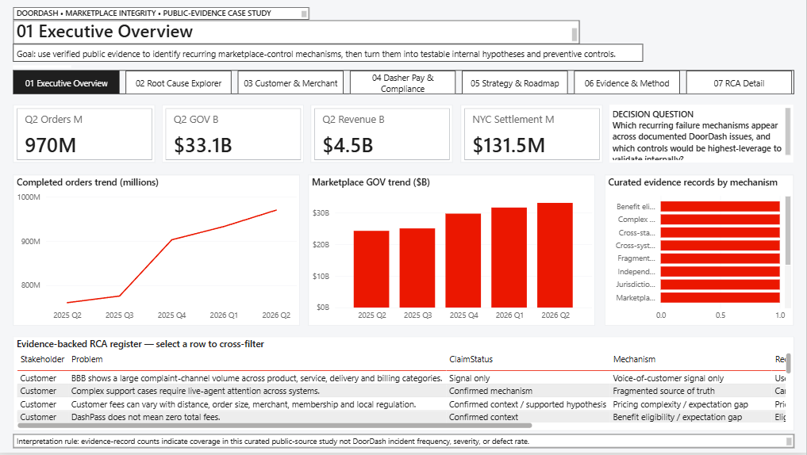
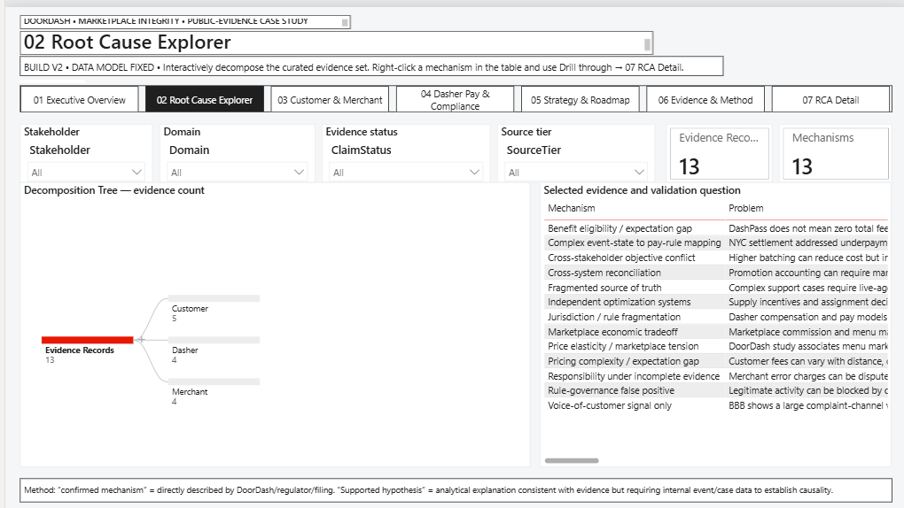
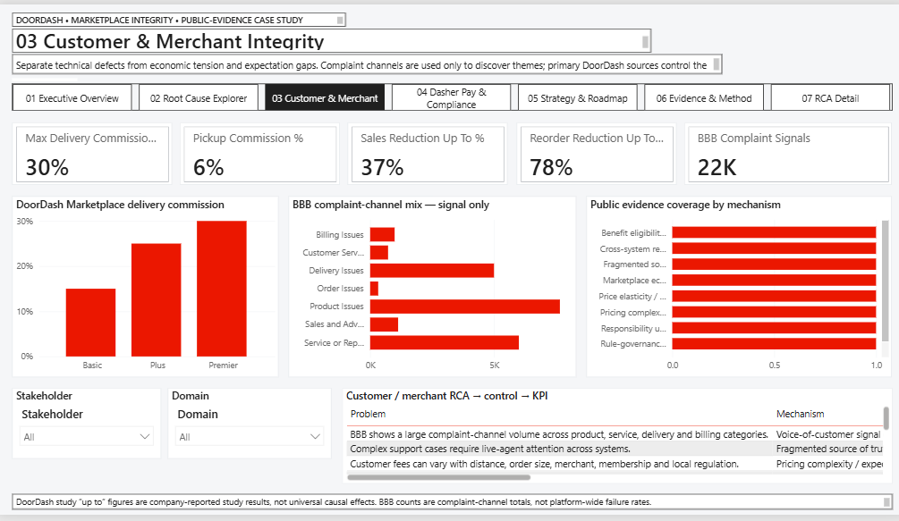
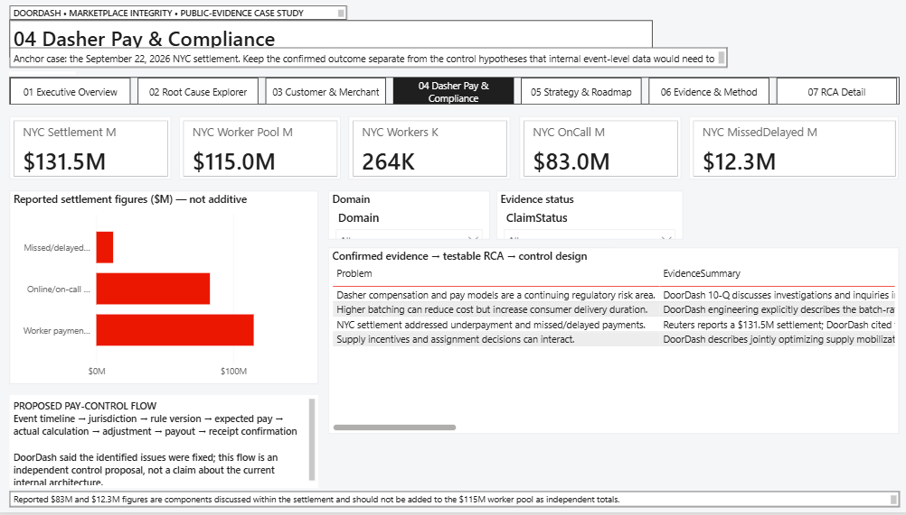
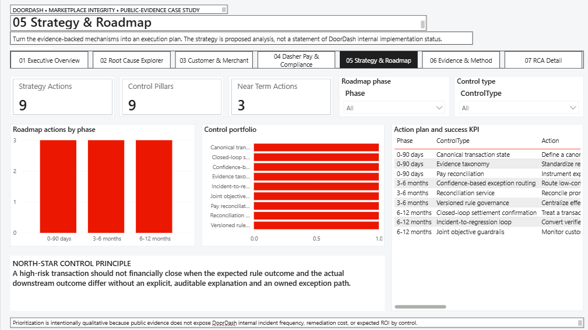
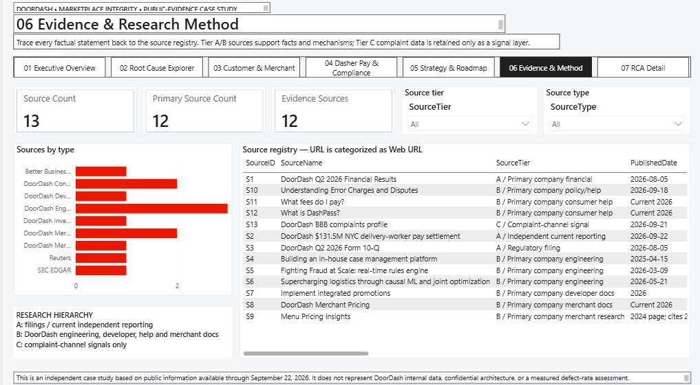
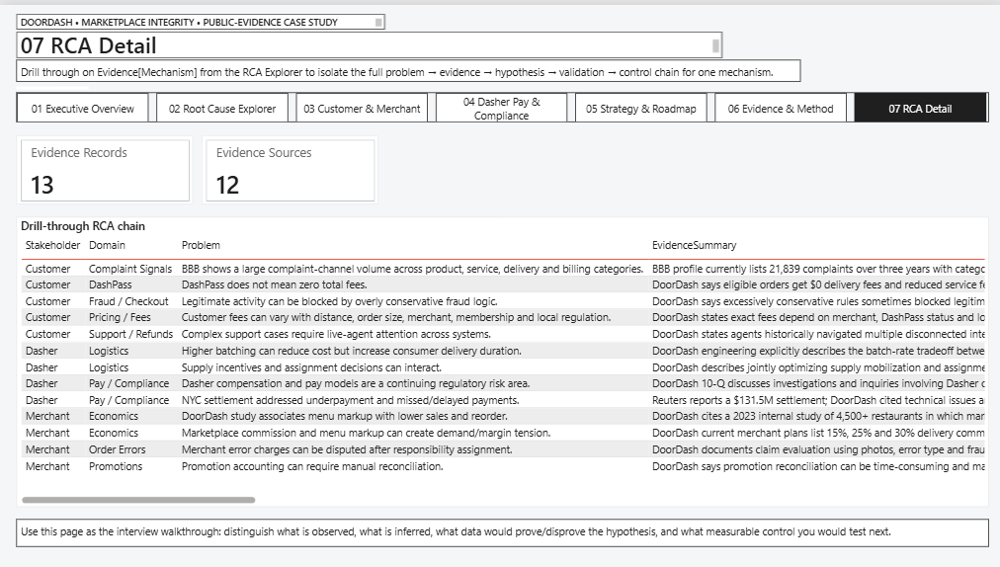

# DoorDash Marketplace Integrity
## Power BI Root Cause Analysis & Control Strategy

An independent **Power BI case study** using public DoorDash evidence to investigate recurring marketplace-control risks across **Customers, Merchants, and Dashers**.

> **Business Question**  
> Where can expected marketplace outcomes diverge from actual operational or financial outcomes, what recurring mechanisms appear across documented issues, and which controls should be investigated first?

**Research coverage:** Public information available through September 22, 2026.

---

# Project Overview

DoorDash operates a three-sided marketplace connecting:

**Customers ↔ Merchants ↔ Dashers**

A single order can move through multiple business and technical stages:

**Catalog → Promotions → Pricing → Checkout → Payment → Merchant Fulfillment → Dispatch → Delivery → Support → Settlement**

The challenge is not simply whether one system works correctly.

The larger question is whether the **same transaction remains consistent as it moves across multiple systems, rules, stakeholders, and financial states**.

This project investigates that problem using:

**Problem → Evidence → Root Cause → Internal Validation → Control Strategy → KPI**

---

# Dashboard Walkthrough

## 01 — Executive Overview



### What this page answers

**What is the scale of the marketplace and which recurring control mechanisms appear across the research?**

The Executive Overview establishes the business context before moving into Root Cause Analysis.

It includes:

- Q2 2026 Total Orders
- Marketplace GOV
- Revenue
- NYC Dasher-pay settlement
- quarterly marketplace trends
- recurring RCA mechanisms
- evidence-backed RCA register

The dashboard uses public evidence to identify areas worth investigating.

It does **not** use complaint counts or public incidents as a proxy for DoorDash-wide defect rates.

---

## 02 — Root Cause Explorer



### What this page answers

**What underlying mechanisms appear across Customer, Merchant, and Dasher issues?**

The Power BI **Decomposition Tree** allows the analysis to move through:

**Stakeholder → Domain → Problem → Mechanism → Control Type → Claim Status**

Interactive filters allow the user to explore the evidence by:

- Stakeholder
- Domain
- Claim Status
- Source Tier

The RCA model intentionally separates:

**Confirmed Incident → Confirmed Mechanism → Supported Hypothesis → Internal Validation Required**

A public incident may confirm that a problem occurred, but it does not automatically prove the exact technical root cause.

---

## 03 — Customer & Merchant Integrity



### What this page answers

**Where can pricing, merchant economics, promotions, and responsibility create marketplace-integrity risk?**

The analysis explores:

- merchant commission structure
- menu-pricing economics
- pricing and fee expectations
- promotion reconciliation
- merchant error responsibility
- complaint-channel signals

One important distinction in this page is between **business-model tension and technical failure**.

For example, higher merchant costs or menu markups may create marketplace friction without necessarily representing a system defect.

Complaint data is therefore treated as **signal only**, not as proof of platform-wide failure.

---

## 04 — Dasher Pay & Compliance



### What this page answers

**How can complex delivery states create compensation and settlement-control risk?**

The September 22, 2026 New York City delivery-worker settlement is used as the strongest real-world case in the analysis.

The control chain examined is:

**Delivery Event → Jurisdiction → Pay Rule → Expected Pay → Actual Pay → Adjustment → Payout**

The public evidence confirms that compensation-related problems occurred.

The project then asks a separate analytical question:

> **Could stronger event-level reconciliation detect incorrect or delayed compensation before payout closes?**

That is treated as a **control hypothesis requiring internal DoorDash data to validate**, rather than a confirmed description of DoorDash's internal architecture.

---

## 05 — Strategy & Roadmap



### What this page answers

**What should happen after the Root Cause Analysis?**

The project does not stop at identifying problems.

The findings are translated into five proposed control areas:

### 1. Canonical Transaction State
Maintain a traceable representation of critical operational and financial states across system handoffs.

### 2. Versioned Rule Governance
Record which rule, version, jurisdiction, and eligibility conditions produced an important automated decision.

### 3. Expected-vs-Actual Reconciliation
Compare what **should have happened** with what **actually happened** before financial closure.

### 4. Explainable Exception Routing
Route low-confidence automated decisions into structured review with evidence and reason codes.

### 5. Closed-Loop Settlement
Keep unresolved financial mismatches open until the downstream result is confirmed or corrected.

### North-Star Control Principle

> **A high-risk transaction should not financially close when the expected rule outcome and actual downstream outcome differ without an explicit, auditable explanation and an owned exception path.**

These are analytical recommendations, not claims about DoorDash's current internal implementation.

---

## 06 — Evidence & Research Method



### What this page answers

**Where did the evidence come from and how reliable is each claim?**

The project uses an evidence hierarchy rather than treating every public source equally.

### Tier A — Primary External Evidence

Examples:

- regulators
- SEC filings
- regulator-backed settlements
- high-quality independent reporting

### Tier B — DoorDash First-Party Evidence

Examples:

- DoorDash Engineering
- DoorDash Developer documentation
- DoorDash Merchant documentation
- DoorDash Investor Relations
- DoorDash product and support documentation

### Tier C — Complaint / Community Signals

Used only to identify:

- recurring themes
- possible edge cases
- areas worth investigating

Tier C evidence is **not used to establish prevalence or causality**.

---

## 07 — RCA Detail



### What this page answers

**What is the complete reasoning chain behind an individual root-cause hypothesis?**

The drill-through page connects:

**Problem → Evidence → Mechanism → Root-Cause Hypothesis → Internal Validation Question → Recommended Control → KPI**

This allows the user to move from a high-level RCA pattern into the actual reasoning behind the hypothesis.

---

# Main Root Cause Themes

The research identified six recurring analytical themes.

## 1. Fragmented State / Source of Truth

Different systems may require the same order, case, customer, merchant, or financial context while operating from separate sources.

This can increase:

- context switching
- manual reconciliation
- incomplete case visibility
- exception-resolution time

### Key Question

**Are critical states synchronized across the systems that consume them?**

---

## 2. Rule-Governance Complexity

Marketplace decisions can depend on combinations of:

- geography
- eligibility
- transaction state
- time
- rule version
- jurisdiction
- exception conditions

This makes testing, versioning, explainability, and auditability important controls.

### Key Question

**Can an important automated decision be traced back to the exact rule and context that produced it?**

---

## 3. Cross-System Reconciliation

A financial value may pass through multiple systems before the transaction is complete.

Example:

**Customer Checkout → Payment → Promotion Funding → Merchant Accounting → Final Settlement**

### Key Question

**Does the financial state remain consistent across every downstream system?**

---

## 4. Independent Optimization / Objective Tradeoffs

Marketplace systems often optimize different objectives.

For example:

**Higher batching efficiency**

may reduce:

**duplicate travel and delivery cost**

while potentially increasing:

**customer delivery duration**

This is not automatically a defect.

It represents a **multi-objective optimization problem**.

### Key Question

**Are individual systems improving local metrics while creating negative outcomes elsewhere in the marketplace?**

---

## 5. Exception Handling Under Uncertainty

Automation is necessary at marketplace scale.

However, uncertain cases may require:

- confidence scores
- evidence
- explainability
- escalation
- human review
- authorized overrides

### Key Question

**When automation is uncertain, is there a clear path for investigation and correction?**

---

## 6. Transaction & Settlement Integrity

Complex operational states eventually need to produce the correct financial outcome.

The central reconciliation question becomes:

> **Does the expected outcome match the actual downstream outcome?**

---

# Future-State Control Model

```text
Expected Outcome
      ↓
Actual Outcome
      ↓
Reconciliation
      ↓
     Match?
     /    \
   Yes     No
    ↓       ↓
  Close   Exception
            ↓
     Evidence + Confidence
          /        \
   Auto-correct   Human Review
          \        /
           ↓      ↓
      Settlement Confirmed
```

The goal is to identify inconsistencies **before they become customer complaints, merchant disputes, compensation issues, or regulatory problems**.

---

# What I Would Validate With Internal Data

If this were an internal DoorDash engagement, the next step would be to test the public-evidence hypotheses using transaction-level data.

### Customer

- displayed price vs. authorized payment
- authorized payment vs. settled amount
- promotion eligibility vs. promotion actually applied
- support decision vs. appeal outcome

### Merchant

- merchant-funded vs. DoorDash-funded promotions
- promotion reconciliation
- error responsibility assignment
- disputed charges vs. overturned decisions
- menu markup vs. conversion and reorder behavior

### Dasher

- expected compensation vs. actual compensation
- jurisdiction applied
- pay-rule version
- adjustments
- payout timing
- payout confirmation

### Marketplace / Logistics

- batching vs. delivery duration
- batching vs. Dasher miles
- merchant wait time
- cancellation rate
- cost per delivery
- customer experience

This would convert the public-evidence RCA into a measurable **Marketplace Integrity Monitoring Framework**.

---

# Power BI Skills Demonstrated

This project uses:

- **Power BI Desktop**
- **DAX**
- **TMDL semantic modeling**
- **Decomposition Tree**
- **Drill-through**
- **Cross-filtering**
- **Dropdown slicers**
- **KPI cards**
- **Line charts**
- **Bar and column charts**
- **Analytical tables**
- **Page navigation**
- **Evidence classification**
- **Root Cause Analysis**

---

# Example DAX

```DAX
Evidence Records =
COUNTROWS(Evidence)
```

```DAX
Q2 Orders M =
DIVIDE(
    CALCULATE(
        MAX(PublicKPI[Value]),
        PublicKPI[MetricID] = "ORDERS_Q2_2026"
    ),
    1000000
)
```

---

# Public Sources

## DoorDash Q2 2026 Financial Results

**Publisher:** DoorDash Investor Relations  
**Used for:** Marketplace scale and quarterly financial metrics.

https://ir.doordash.com/financials/quarterly-results/

---

## NYC Delivery-Worker Pay Settlement

**Publisher:** Reuters  
**Date:** September 22, 2026  
**Used for:** Dasher Pay & Compliance case study.

https://www.reuters.com/world/doordash-reaches-1315-million-settlement-with-nyc-over-delivery-workers-pay-2026-09-22/

---

## DoorDash Case Management Platform

**Publisher:** DoorDash Engineering  
**Used for:** Fragmented-state and source-of-truth analysis.

https://careersatdoordash.com/blog/doordash-case-management-platform/

---

## DoorDash Real-Time Fraud Rules Engine

**Publisher:** DoorDash Engineering  
**Used for:** Rule-governance complexity, false-positive risk, explainability, testing, and auditability.

https://careersatdoordash.com/blog/doordash-fraud-insights-from-building-a-real-time-rules-engine/

---

## DoorDash Logistics — Causal ML & Joint Optimization

**Publisher:** DoorDash Engineering  
**Used for:** Marketplace optimization and batching tradeoffs.

https://careersatdoordash.com/blog/supercharging-doordash-logistics-through-causal-ml-and-joint-optimization/

---

## DoorDash Integrated Promotions

**Publisher:** DoorDash Developer Services  
**Used for:** Promotion funding and reconciliation analysis.

https://developer.doordash.com/docs/marketplace/how_to/integrated_promotions/

---

## DoorDash Merchant Pricing

**Publisher:** DoorDash for Merchants  
**Used for:** Merchant commission and marketplace-economics context.

https://merchants.doordash.com/en-us/pricing

---

## DoorDash Menu Pricing Insights

**Publisher:** DoorDash for Merchants  
**Used for:** Menu-pricing and marketplace-demand context.

https://merchants.doordash.com/en-us/learning-center/menu-pricing-insights

---

## DoorDash July 9, 2025 Service Incident

**Publisher:** DoorDash Engineering  
**Used for:** Cross-service dependency and cascading-failure context.

https://careersatdoordash.com/blog/july-9-2025-incident-and-steps-forward/

---

# Repository Contents

```text
DoorDash-Marketplace-Integrity-Root-Cause-Analysis-Control-Strategy/
│
├── README.md
├── DoorDash_Marketplace_Rootcause_Analysis.pbip
├── data/
│
├── 01-executive-overview.png.png
├── 02-root-cause-explorer.png.png
├── 03-customer-merchant.png.png
├── 04-dasher-pay.png.png
├── 05-strategy-roadmap.png.png
├── 06-evidence-method.png.png
└── 07-rca-detail.png.png
```

> **Power BI note:** A complete PBIP project normally also contains its associated `.Report` and `.SemanticModel` folders. If the repository is intended to be cloned and opened directly in Power BI Desktop, those project folders should be included with the `.pbip` file.

---

# Limitations

This project uses **public information only**.

It does not use:

- DoorDash internal transaction data
- private production logs
- confidential architecture
- internal experiments
- internal defect rates
- confidential financial information

Public evidence can confirm that a problem occurred without necessarily establishing its exact technical cause.

Where causality is not directly established, the project treats the explanation as a **hypothesis requiring internal validation**.

---

# Disclaimer

This is an **independent analytical case study based on publicly available information**.

It is not affiliated with, sponsored by, endorsed by, or produced for DoorDash, Inc.

No confidential DoorDash information was used.

---

# Author

**Dhrumi Kansara**  
Business Analyst | Data & Product Analytics

**Business Analysis · Product Analytics · Root Cause Analysis · Strategy & Operations · Power BI · DAX**
